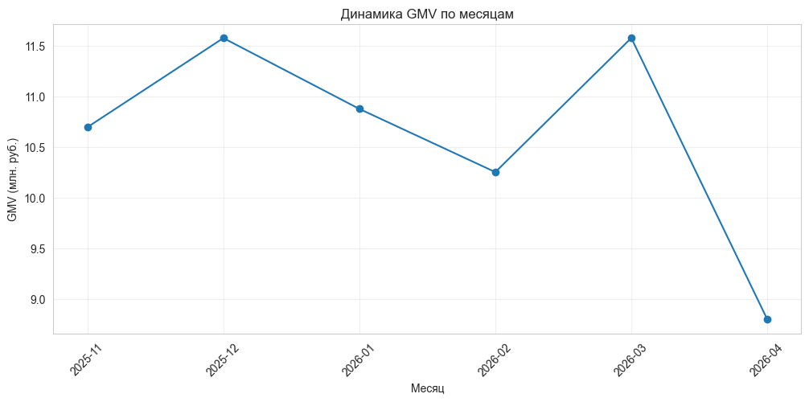
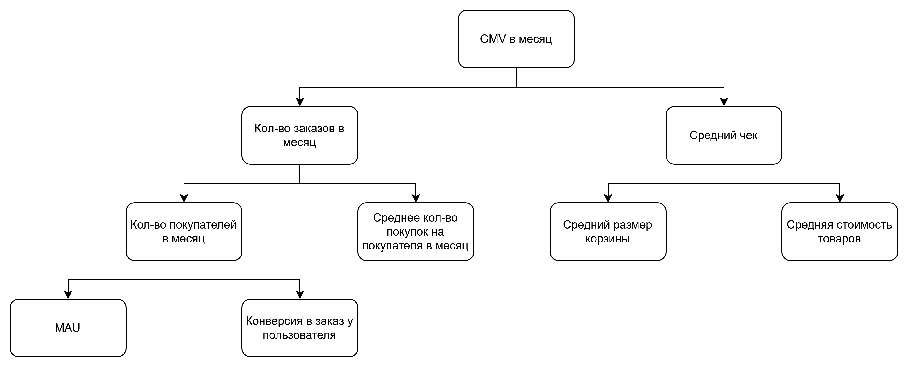
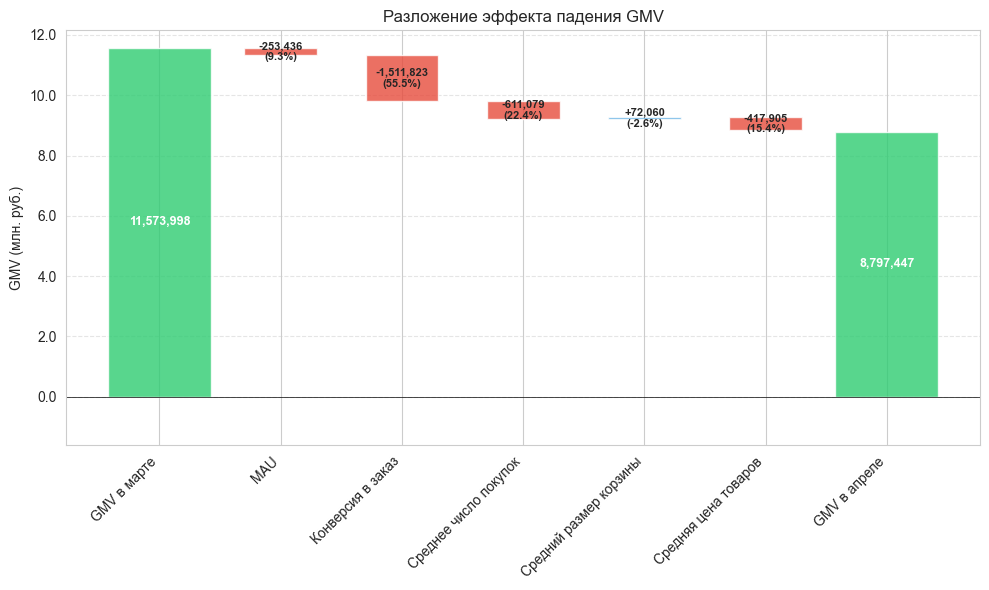
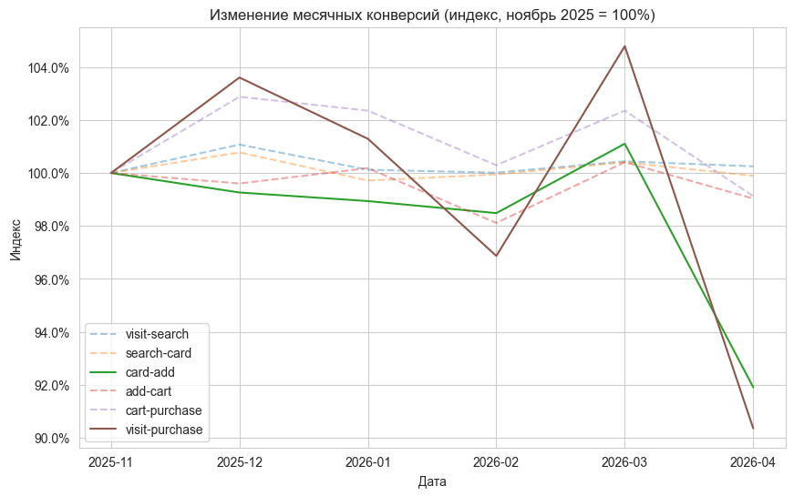

# GMV Drop Analysis | Online Retailing Case Study

## Setting
In this repository, I report a comprehensive product analysis in Jupyter notebook based on synthetic data from online retailing company. The data features:
- [Orders information](),
- [User funnel information](),
- [Marketing communications information with A/B tests splits]().

The analysis and results are reported in the single [Jupyter notebook]().

## Main Results

The key metric for this business is *Gross Merchandise Value*, which dropped during April, 2026:

The metric can be decomposed using key factors: number of orders and AOV. Then, each subcomponents is split into respective factors forming a tree:

The effect is then decomposed according to main factors:

Furthermore, I spot the drop in the specific part of the funnel:

The marketing communications changed significantly in April, 2026: sending time changed to morning and more communications started to be sent through email. I used A/B tests splits to discover if the change in marketing strategy has any significant effect to the drop in the conversion from item card to cart adding.

### Effect table

| Period | Mean effect |
|--------|-------------|
| Before April | 0.108850 |
| After April  | 0.005614 |

### Statistical test results

| Test | p-value |
|------|---------|
| Welch's t-test | 0.045519 |
| Mann-Whitney U | 0.027030 |

The statistical test results report that with 5% confidence level, there is a significant evidence to claim the effect of marketing change in the drop of conversion and thus GMV.
